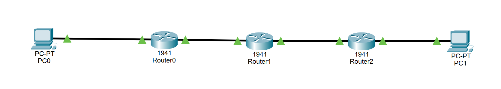

# 🌐 OSPF Lab Basic – Cisco Packet Tracer

Este laboratorio simula una topología de red profesional con **OSPF** como protocolo de routing dinámico. Está diseñado para practicar **configuración de routers, creación de vecindades, convergencia, intercambio de rutas y validación de conectividad**.

---

## 🗺️ Topología del laboratorio




- 3 routers Cisco
- 2 PCs
- 2 redes LAN
- Enlaces punto a punto
- Área OSPF única (área 0)

---

## 📁 Estructura del repositorio

```
ospf-lab-basic/
├── README.md # Este archivo
├── topology.png # Imagen de la topología
├── project.pkt # Archivo Packet Tracer
├── configs/
│ ├── R1.conf
│ ├── R2.conf
│ └── R3.conf
├── validation.txt # Lista de pruebas realizadas
└── docs/
├── lab-instructions.md # Paso a paso de configuración
└── screenshots/ # Capturas de pantalla de pruebas
```

---


---

## 🎯 Objetivos del laboratorio

- Configurar OSPF en tres routers Cisco
- Crear vecindades OSPF y verificar estado FULL
- Intercambiar rutas dinámicas entre routers
- Validar conectividad entre redes LAN
- Analizar tablas de rutas y protocolos en routers
- Practicar troubleshooting y simulación profesional de redes

---

## ⚡ Configuración básica

- Todos los routers tienen **Router IDs únicos**:
  - R1 = 1.1.1.1
  - R2 = 2.2.2.2
  - R3 = 3.3.3.3
- Todas las interfaces están activadas con `no shutdown`
- Todas las redes pertenecen a **área 0** (backbone OSPF)
- Direccionamiento IP asignado para enlaces punto a punto y LANs

> Los archivos de configuración completos están en la carpeta `configs/`.

---

## ✅ Validaciones realizadas

- Vecindades OSPF FULL entre R1-R2 y R2-R3
- Todas las redes accesibles mediante OSPF
- Ping exitoso entre PC1 → PC2
- Rutas OSPF visibles en la tabla de rutas de cada router
- No se utilizaron rutas estáticas

---

## 📚 Uso del laboratorio

1. Abrir `project.pkt` en Cisco Packet Tracer.
2. Configurar interfaces y OSPF según `configs/`.
3. Realizar pruebas de conectividad con `ping` desde PCs.
4. Verificar vecindades OSPF y rutas con comandos en routers:
   ```bash
   show ip ospf neighbor
   show ip route
   show ip protocols
   show ip ospf interface
   ```
5. Cambiar a **Simulation Mode** para observar los paquetes ICMP a través de la red

---

## 👤 Autor

Manuel Míguez Liméns

[GitHub](https://github.com/manuelmiguezlimens?tab=repositories) | [LinkedIn](https://www.linkedin.com/in/manuelmiguezlimens/) | [Gmail](mailto:miguezlimensmanuel@gmail.com)